# OpenClaudeCode - 还原后的 Claude Code 源码


> 基于 `@anthropic-ai/claude-code` v2.1.88 源码分析
> 本项目供学习研究使用

---

## 项目简介

这个仓库是一个主要通过 source map 逆向还原、再补齐缺失模块后得到的 Claude Code 源码树。

它并不是上游仓库的原始状态。部分文件无法仅凭 source map 恢复，因此目前仍包含兼容 shim 或降级实现，以便项目可以重新安装并运行。

Claude Code 是 Anthropic 开发的 AI 编程助手 CLI 工具，基于 **React/Ink** 构建终端 UI，通过 **Claude API** 进行 AI 对话，支持 **30+ 内置工具**（Bash、文件操作、搜索等）、**MCP 协议扩展**、**多 Agent 协调**、**远程会话**等高级能力。

### 当前状态

- 该源码树已经可以在本地开发流程中恢复并运行。
- `bun install` 可以成功执行。
- `bun run version` 可以成功执行。
- `bun run dev` 现在会通过还原后的真实 CLI bootstrap 启动，而不是临时的 `dev-entry`。
- `bun run dev --help` 可以显示还原后的完整命令树。
- 仍有部分模块保留恢复期 fallback，因此行为可能与原始 Claude Code 实现不同。

### 已恢复内容

最近一轮恢复工作已经补回了最初 source-map 导入之外的几个关键部分：

- 默认 Bun 脚本现在会走真实的 CLI bootstrap 路径
- `claude-api` 和 `verify` 的 bundled skill 内容已经从占位文件恢复为可用参考文档
- Chrome MCP 和 Computer Use MCP 的兼容层现在会暴露更接近真实的工具目录，并返回结构化的降级响应，而不是空 stub
- 一些显式占位资源已经替换为可用的 planning 与 permission-classifier fallback prompt

当前剩余缺口主要集中在私有或原生集成部分，这些实现无法仅凭 source map 完整恢复，因此这些区域仍依赖 shim 或降级行为。

### 为什么会有这个仓库

source map 本身并不能包含完整的原始仓库：

- 类型专用文件经常缺失
- 构建时生成的文件可能不存在
- 私有包包装层和原生绑定可能无法恢复
- 动态导入和资源文件经常不完整

这个仓库的目标是把这些缺口补到"可用、可运行"的程度，形成一个可继续修复的恢复工作区。

---

## 运行方式

环境要求：

- Bun 1.3.5 或更高版本
- Node.js 24 或更高版本

安装依赖：

```bash
bun install
```

运行恢复后的 CLI：

```bash
bun run dev
```

输出恢复后的版本号：

```bash
bun run version
```

---

## 技术栈

| 层级 | 技术 |
|------|------|
| 运行时 | Node.js / Bun |
| 语言 | TypeScript / TSX |
| 终端 UI | React + Ink (自定义渲染引擎) |
| API 通信 | Anthropic SDK (Streaming) |
| 扩展协议 | MCP (Model Context Protocol) |
| 构建 | Bun bundler (单文件 `cli.js` 输出) |
| 包管理 | npm |

### 核心数据

- **源文件数量**: 1,884 个 `.ts/.tsx` 文件
- **工具数量**: 45+ 内置工具
- **命令数量**: 100+ 斜杠命令
- **React Hooks**: 87 个自定义 Hook

---

## 整体架构图


```mermaid
graph TB
    subgraph "用户接口层 (User Interface)"
        CLI["CLI 入口<br/>cli.tsx"]
        SDK["SDK 入口<br/>QueryEngine API"]
        IDE["IDE 扩展<br/>VS Code / JetBrains"]
        WEB["Web 入口<br/>Claude.ai/code"]
    end

    subgraph "应用编排层 (Application Orchestration)"
        MAIN["main.tsx<br/>主编排器"]
        INIT["init.ts<br/>初始化管线"]
        SETUP["setup.ts<br/>首次配置"]
    end

    subgraph "交互层 (Interaction Layer)"
        REPL["REPL.tsx<br/>交互式循环"]
        CMD["commands.ts<br/>命令注册表"]
        KB["keybindings/<br/>快捷键系统"]
        DIALOG["dialogLaunchers.tsx<br/>对话框启动器"]
    end

    subgraph "核心引擎层 (Core Engine)"
        QE["QueryEngine.ts<br/>查询引擎"]
        QL["query.ts<br/>查询循环(AsyncGenerator)"]
        TOOL_REG["tools.ts<br/>工具注册表"]
        TOOL_BASE["Tool.ts<br/>工具基类"]
        TASK["Task.ts<br/>任务模型"]
    end

    subgraph "工具层 (Tool Layer)"
        BASH["BashTool<br/>Shell 执行"]
        FILE_R["FileReadTool<br/>文件读取"]
        FILE_E["FileEditTool<br/>文件编辑"]
        FILE_W["FileWriteTool<br/>文件写入"]
        GREP["GrepTool<br/>内容搜索"]
        GLOB["GlobTool<br/>文件搜索"]
        AGENT["AgentTool<br/>子Agent派生"]
        WEB_F["WebFetchTool<br/>网络请求"]
        MCP_T["MCPTool<br/>MCP 动态工具"]
        MORE["... 35+ 其他工具"]
    end

    subgraph "服务层 (Services)"
        API["api/<br/>Claude API 客户端"]
        MCP_S["mcp/<br/>MCP 服务"]
        COMPACT["compact/<br/>上下文压缩"]
        LSP["lsp/<br/>语言服务"]
        ANALYTICS["analytics/<br/>遥测分析"]
        AUTH["auth<br/>认证服务"]
    end

    subgraph "状态层 (State Layer)"
        STORE["store.ts<br/>状态存储"]
        APP_STATE["AppState.tsx<br/>React Context"]
        BOOT_STATE["bootstrap/state.ts<br/>全局会话状态"]
        CTX["context.ts<br/>系统/用户上下文"]
    end

    subgraph "基础设施层 (Infrastructure)"
        PERM["permissions/<br/>权限系统"]
        CONFIG["config.ts<br/>配置管理"]
        SETTINGS["settings/<br/>设置解析"]
        GIT["git.ts<br/>Git 操作"]
        SHELL["Shell.ts<br/>Shell 抽象"]
        MEMDIR["memdir/<br/>持久化记忆"]
        MIGRATE["migrations/<br/>数据迁移"]
    end

    subgraph "渲染层 (Rendering)"
        INK["ink/<br/>自定义 Ink 引擎"]
        COMP["components/<br/>146 React 组件"]
        HOOKS["hooks/<br/>87 自定义 Hooks"]
    end

    %% 连接关系
    CLI --> MAIN
    SDK --> QE
    IDE --> MAIN
    WEB --> MAIN

    MAIN --> INIT
    MAIN --> SETUP
    MAIN --> REPL
    MAIN --> QE

    REPL --> CMD
    REPL --> KB
    REPL --> DIALOG
    REPL --> QE

    QE --> QL
    QL --> TOOL_REG
    QL --> API
    TOOL_REG --> TOOL_BASE

    TOOL_BASE --> BASH
    TOOL_BASE --> FILE_R
    TOOL_BASE --> FILE_E
    TOOL_BASE --> FILE_W
    TOOL_BASE --> GREP
    TOOL_BASE --> GLOB
    TOOL_BASE --> AGENT
    TOOL_BASE --> WEB_F
    TOOL_BASE --> MCP_T
    TOOL_BASE --> MORE

    API --> AUTH
    MCP_S --> MCP_T
    QL --> COMPACT
    QL --> CTX

    REPL --> COMP
    COMP --> INK
    COMP --> HOOKS
    HOOKS --> APP_STATE
    APP_STATE --> STORE

    BOOT_STATE --> CONFIG
    CONFIG --> SETTINGS
    PERM --> SETTINGS

    TOOL_BASE --> PERM
    TOOL_BASE --> SHELL
    TOOL_BASE --> GIT

    CTX --> MEMDIR
    CTX --> GIT

    INIT --> MIGRATE
    INIT --> ANALYTICS

    style CLI fill:#4A90D9,color:#fff
    style SDK fill:#4A90D9,color:#fff
    style IDE fill:#4A90D9,color:#fff
    style WEB fill:#4A90D9,color:#fff
    style QE fill:#E8744F,color:#fff
    style QL fill:#E8744F,color:#fff
    style API fill:#50C878,color:#fff
    style MCP_S fill:#50C878,color:#fff
    style STORE fill:#9B59B6,color:#fff
    style PERM fill:#F39C12,color:#fff
```

---

## 目录结构与模块职责

```
restored-src/src/
├── main.tsx                    # [803KB] CLI 主入口 & 编排器
├── QueryEngine.ts              # [46KB]  SDK 查询引擎封装
├── query.ts                    # [68KB]  核心查询循环 (AsyncGenerator)
├── Tool.ts                     # [29KB]  工具抽象基类 & 类型定义
├── Task.ts                     # [3KB]   后台任务模型
├── commands.ts                 # [25KB]  命令注册表 (60+ 命令)
├── tools.ts                    # [17KB]  工具注册表 & 组装
├── context.ts                  # [6KB]   系统/用户上下文 (memoized)
├── setup.ts                    # [20KB]  首次运行配置
├── cost-tracker.ts             # [10KB]  费用追踪
├── history.ts                  # [14KB]  会话历史管理
├── interactiveHelpers.tsx       # [57KB]  交互式辅助组件
├── dialogLaunchers.tsx          # [22KB]  对话框启动器
│
├── entrypoints/                # 入口点
│   ├── cli.tsx                 # CLI 启动入口
│   └── init.ts                 # 初始化管线 (memoized)
│
├── bootstrap/                  # 引导状态
│   └── state.ts                # [56KB] 全局会话状态 (getSessionId, getCwd...)
│
├── tools/                      # 45+ 工具实现
│   ├── BashTool/               #   每个工具一个目录
│   │   ├── BashTool.tsx        #   工具实现
│   │   ├── prompt.ts           #   系统提示词片段
│   │   ├── UI.tsx              #   React 渲染组件
│   │   └── bashPermissions.ts  #   权限检查
│   ├── FileReadTool/
│   ├── FileEditTool/
│   ├── FileWriteTool/
│   ├── GrepTool/
│   ├── GlobTool/
│   ├── AgentTool/              #   子 Agent 派生
│   ├── MCPTool/                #   MCP 动态工具
│   └── ...
│
├── commands/                   # 100+ 斜杠命令
│   ├── commit.ts
│   ├── review.ts
│   ├── config.ts
│   └── ...
│
├── services/                   # 服务层
│   ├── api/                    #   Claude API 客户端
│   │   ├── client.ts           #     SDK 客户端创建
│   │   ├── claude.ts           #     [125KB] 消息流 & 工具序列化
│   │   ├── withRetry.ts        #     重试策略
│   │   └── errors.ts           #     错误分类
│   ├── mcp/                    #   MCP 服务
│   │   ├── client.ts           #     [120KB] MCP 客户端
│   │   ├── config.ts           #     MCP 服务器配置
│   │   └── auth.ts             #     [90KB] OAuth 认证
│   ├── compact/                #   上下文压缩
│   ├── lsp/                    #   语言服务器协议
│   └── analytics/              #   遥测分析
│
├── components/                 # 146 个 React/Ink 组件
│   ├── App.tsx                 #   根组件
│   ├── FullscreenLayout.tsx    #   [85KB] 主布局
│   ├── REPL.tsx                #   交互式循环
│   └── ...
│
├── hooks/                      # 87 个自定义 Hooks
│   ├── useCanUseTool.tsx       #   [40KB] 权限检查 Hook
│   ├── useGlobalKeybindings.tsx#   [31KB] 全局快捷键
│   └── ...
│
├── state/                      # 状态管理
│   ├── store.ts                #   最小化状态存储
│   ├── AppState.tsx            #   React Context Provider
│   └── AppStateStore.ts        #   AppState 类型定义
│
├── ink/                        # 自定义终端 UI 引擎
│   ├── reconciler.ts           #   React reconciler
│   ├── renderer.ts             #   终端输出生成
│   ├── layout/                 #   Yoga 布局引擎
│   └── events/                 #   事件系统
│
├── context/                    # React Contexts
│   ├── modalContext.tsx
│   ├── notifications.tsx
│   └── mailbox.tsx             #   Agent 间消息邮箱
│
├── coordinator/                # 多 Agent 协调
│   └── coordinatorMode.ts      #   协调器模式
│
├── skills/                     # 技能系统
│   ├── bundledSkills.ts
│   └── bundled/                #   10+ 内置技能
│
├── plugins/                    # 插件系统
│   ├── builtinPlugins.ts
│   └── bundled/
│
├── bridge/                     # Bridge 通信层
│   ├── bridgeApi.ts
│   ├── sessionRunner.ts
│   └── remoteBridgeCore.ts
│
├── remote/                     # 远程会话
│   ├── RemoteSessionManager.ts
│   └── SessionsWebSocket.ts
│
├── server/                     # 服务器模式
│   ├── directConnectManager.ts
│   └── types.ts
│
├── tasks/                      # 后台任务
│   ├── LocalAgentTask.tsx
│   ├── LocalShellTask.tsx
│   ├── RemoteAgentTask.tsx
│   └── InProcessTeammateTask.tsx
│
├── memdir/                     # 持久化记忆
│   ├── memdir.ts
│   ├── memoryScan.ts
│   └── findRelevantMemories.ts
│
├── vim/                        # Vim 模式
│   ├── motions.ts
│   ├── operators.ts
│   └── transitions.ts
│
├── keybindings/                # 快捷键系统
│   ├── schema.ts
│   ├── match.ts
│   └── defaultBindings.ts
│
├── migrations/                 # 数据迁移
│   └── (11 个迁移文件)
│
├── types/                      # 核心类型定义
│   ├── permissions.ts
│   ├── plugin.ts
│   └── command.ts
│
├── constants/                  # 全局常量
│   ├── product.ts
│   ├── oauth.ts
│   └── betas.ts
│
└── utils/                      # 330+ 工具函数
    ├── auth.ts                 #   [65KB] 认证
    ├── config.ts               #   [63KB] 配置
    ├── git.ts                  #   [30KB] Git 操作
    ├── Shell.ts                #   [16KB] Shell 抽象
    ├── permissions/            #   [26 文件] 权限系统
    ├── settings/               #   [20 文件] 设置解析
    └── ...
```

---

## 核心启动流程时序图

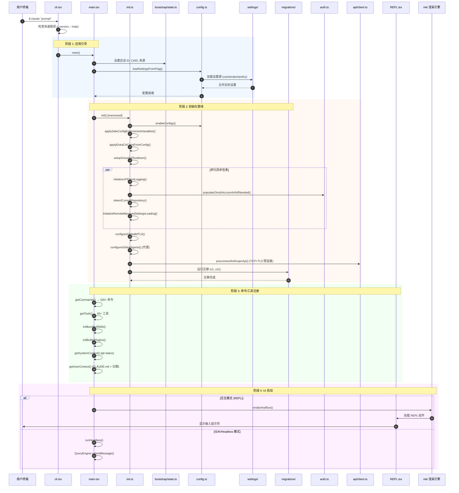
```mermaid
sequenceDiagram
    autonumber
    participant User as 用户终端
    participant CLI as cli.tsx
    participant Main as main.tsx
    participant Init as init.ts
    participant Boot as bootstrap/state.ts
    participant Config as config.ts
    participant Settings as settings/
    participant Migrate as migrations/
    participant Auth as auth.ts
    participant API as api/client.ts
    participant REPL as REPL.tsx
    participant Ink as ink/ 渲染引擎

    User->>CLI: $ claude "prompt"
    CLI->>CLI: 检查快速路径 (--version, --help)

    rect rgb(240, 248, 255)
        Note over CLI,Main: 阶段 1: 应用引导
        CLI->>Main: main()
        Main->>Boot: 设置会话 ID, CWD, 来源
        Main->>Config: loadSettingsFromFlag()
        Config->>Settings: 加载设置源 (user/project/policy)
        Settings-->>Config: 合并后的设置
        Config-->>Main: 配置就绪
    end

    rect rgb(255, 248, 240)
        Note over Main,Migrate: 阶段 2: 初始化管线
        Main->>Init: init() [memoized]
        Init->>Config: enableConfigs()
        Init->>Init: applySafeConfigEnvironmentVariables()
        Init->>Init: applyExtraCACertsFromConfig()
        Init->>Init: setupGracefulShutdown()

        par 并行异步任务
            Init->>Init: initialize1PEventLogging()
            Init->>Auth: populateOAuthAccountInfoIfNeeded()
            Init->>Init: detectCurrentRepository()
            Init->>Init: initializeRemoteManagedSettingsLoading()
        end

        Init->>Init: configureGlobalMTLS()
        Init->>Init: configureGlobalAgents() (代理)
        Init->>API: preconnectAnthropicApi() (TCP+TLS 预连接)
        Init->>Migrate: 运行迁移 (v1..v11)
        Migrate-->>Init: 迁移完成
    end

    rect rgb(240, 255, 240)
        Note over Main,REPL: 阶段 3: 命令/工具注册
        Main->>Main: getCommands() → 100+ 命令
        Main->>Main: getTools() → 45+ 工具
        Main->>Main: initBundledSkills()
        Main->>Main: initBuiltinPlugins()
        Main->>Main: getSystemContext() (git status)
        Main->>Main: getUserContext() (CLAUDE.md + 日期)
    end

    rect rgb(255, 240, 255)
        Note over Main,Ink: 阶段 4: UI 启动
        alt 交互模式 (REPL)
            Main->>Ink: renderAndRun()
            Ink->>REPL: 挂载 REPL 组件
            REPL->>User: 显示输入提示符
        else SDK/Headless 模式
            Main->>Main: runHeadless()
            Main->>Main: QueryEngine.submitMessage()
        end
    end
```

---

## 用户交互查询时序图

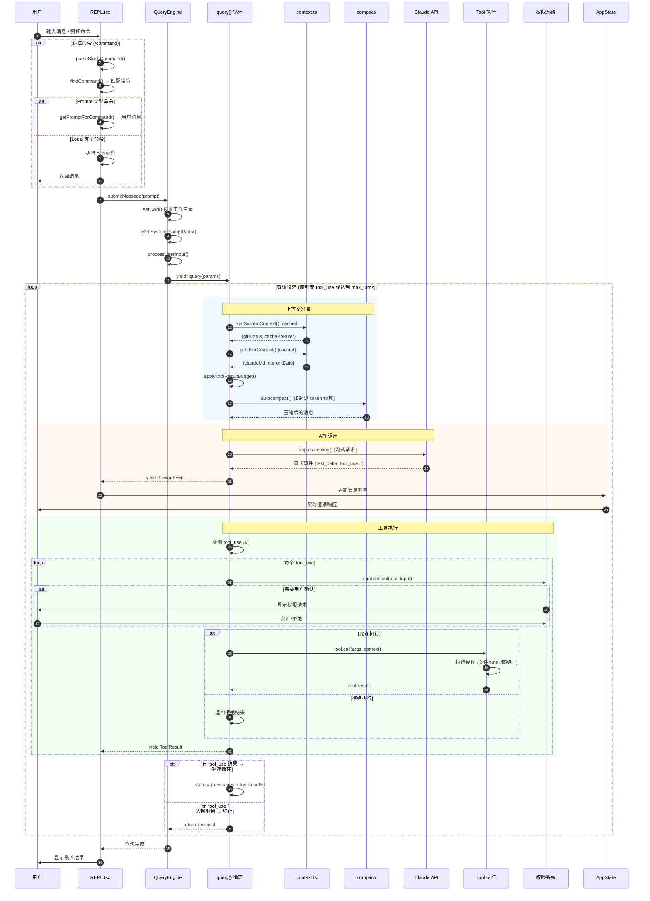
```mermaid
sequenceDiagram
    autonumber
    participant User as 用户
    participant REPL as REPL.tsx
    participant QE as QueryEngine
    participant Query as query() 循环
    participant Ctx as context.ts
    participant Compact as compact/
    participant API as Claude API
    participant Tool as Tool 执行
    participant Perm as 权限系统
    participant State as AppState

    User->>REPL: 输入消息 / 斜杠命令

    alt 斜杠命令 (/command)
        REPL->>REPL: parseSlashCommand()
        REPL->>REPL: findCommand() → 匹配命令
        alt Prompt 类型命令
            REPL->>REPL: getPromptForCommand() → 用户消息
        else Local 类型命令
            REPL->>REPL: 执行本地处理
            REPL->>User: 返回结果
        end
    end

    REPL->>QE: submitMessage(prompt)
    QE->>QE: setCwd() 设置工作目录
    QE->>QE: fetchSystemPromptParts()
    QE->>QE: processUserInput()
    QE->>Query: yield* query(params)

    loop 查询循环 (直到无 tool_use 或达到 max_turns)
        rect rgb(240, 248, 255)
            Note over Query,Compact: 上下文准备
            Query->>Ctx: getSystemContext() [cached]
            Ctx-->>Query: {gitStatus, cacheBreaker}
            Query->>Ctx: getUserContext() [cached]
            Ctx-->>Query: {claudeMd, currentDate}
            Query->>Query: applyToolResultBudget()
            Query->>Compact: autocompact() [如超过 token 预算]
            Compact-->>Query: 压缩后的消息
        end

        rect rgb(255, 248, 240)
            Note over Query,API: API 调用
            Query->>API: deps.sampling() [流式请求]
            API-->>Query: 流式事件 (text_delta, tool_use...)
            Query-->>REPL: yield StreamEvent
            REPL->>State: 更新消息列表
            State->>User: 实时渲染响应
        end

        rect rgb(240, 255, 240)
            Note over Query,Perm: 工具执行
            Query->>Query: 检测 tool_use 块
            loop 每个 tool_use
                Query->>Perm: canUseTool(tool, input)
                alt 需要用户确认
                    Perm->>User: 显示权限请求
                    User->>Perm: 允许/拒绝
                end
                alt 允许执行
                    Query->>Tool: tool.call(args, context)
                    Tool->>Tool: 执行操作 (文件/Shell/网络...)
                    Tool-->>Query: ToolResult
                else 拒绝执行
                    Query->>Query: 返回拒绝结果
                end
                Query-->>REPL: yield ToolResult
            end
        end

        alt 有 tool_use 结果 → 继续循环
            Query->>Query: state = {messages + toolResults}
        else 无 tool_use / 达到限制 → 终止
            Query-->>QE: return Terminal
        end
    end

    QE-->>REPL: 查询完成
    REPL->>User: 显示最终结果
```

---

## 工具执行时序图

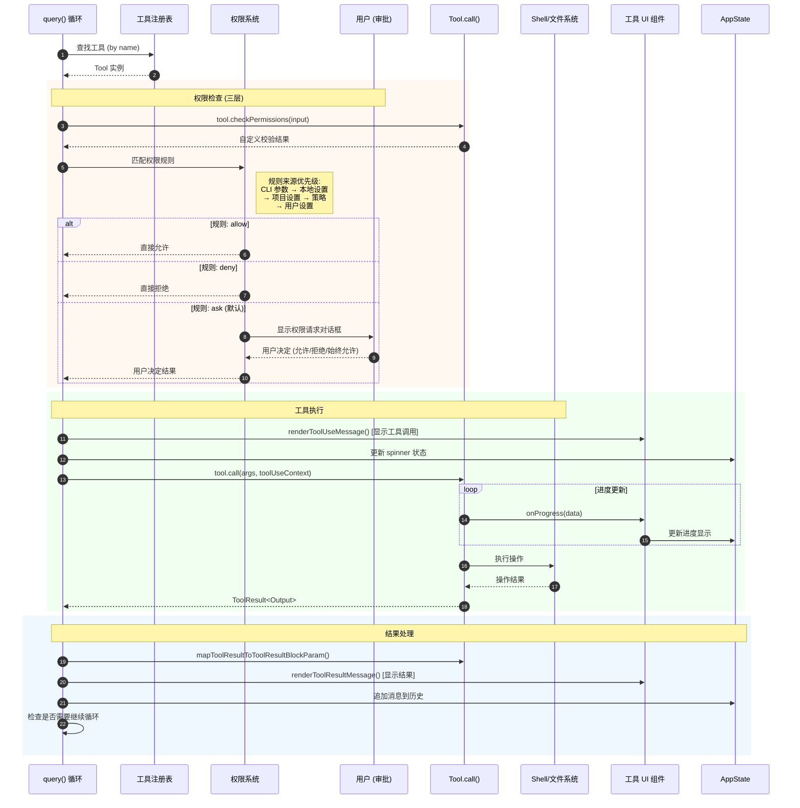
```mermaid
sequenceDiagram
    autonumber
    participant Query as query() 循环
    participant TR as 工具注册表
    participant Perm as 权限系统
    participant User as 用户 (审批)
    participant Tool as Tool.call()
    participant Shell as Shell/文件系统
    participant UI as 工具 UI 组件
    participant State as AppState

    Query->>TR: 查找工具 (by name)
    TR-->>Query: Tool 实例

    rect rgb(255, 248, 240)
        Note over Query,User: 权限检查 (三层)
        Query->>Tool: tool.checkPermissions(input)
        Tool-->>Query: 自定义校验结果

        Query->>Perm: 匹配权限规则
        Note right of Perm: 规则来源优先级:<br/>CLI 参数 → 本地设置<br/>→ 项目设置 → 策略<br/>→ 用户设置

        alt 规则: allow
            Perm-->>Query: 直接允许
        else 规则: deny
            Perm-->>Query: 直接拒绝
        else 规则: ask (默认)
            Perm->>User: 显示权限请求对话框
            User-->>Perm: 用户决定 (允许/拒绝/始终允许)
            Perm-->>Query: 用户决定结果
        end
    end

    rect rgb(240, 255, 240)
        Note over Query,Shell: 工具执行
        Query->>UI: renderToolUseMessage() [显示工具调用]
        Query->>State: 更新 spinner 状态
        Query->>Tool: tool.call(args, toolUseContext)

        loop 进度更新
            Tool->>UI: onProgress(data)
            UI->>State: 更新进度显示
        end

        Tool->>Shell: 执行操作
        Shell-->>Tool: 操作结果
        Tool-->>Query: ToolResult<Output>
    end

    rect rgb(240, 248, 255)
        Note over Query,State: 结果处理
        Query->>Tool: mapToolResultToToolResultBlockParam()
        Query->>UI: renderToolResultMessage() [显示结果]
        Query->>State: 追加消息到历史
        Query->>Query: 检查是否需要继续循环
    end
```

---

## 数据流图

### 核心数据流

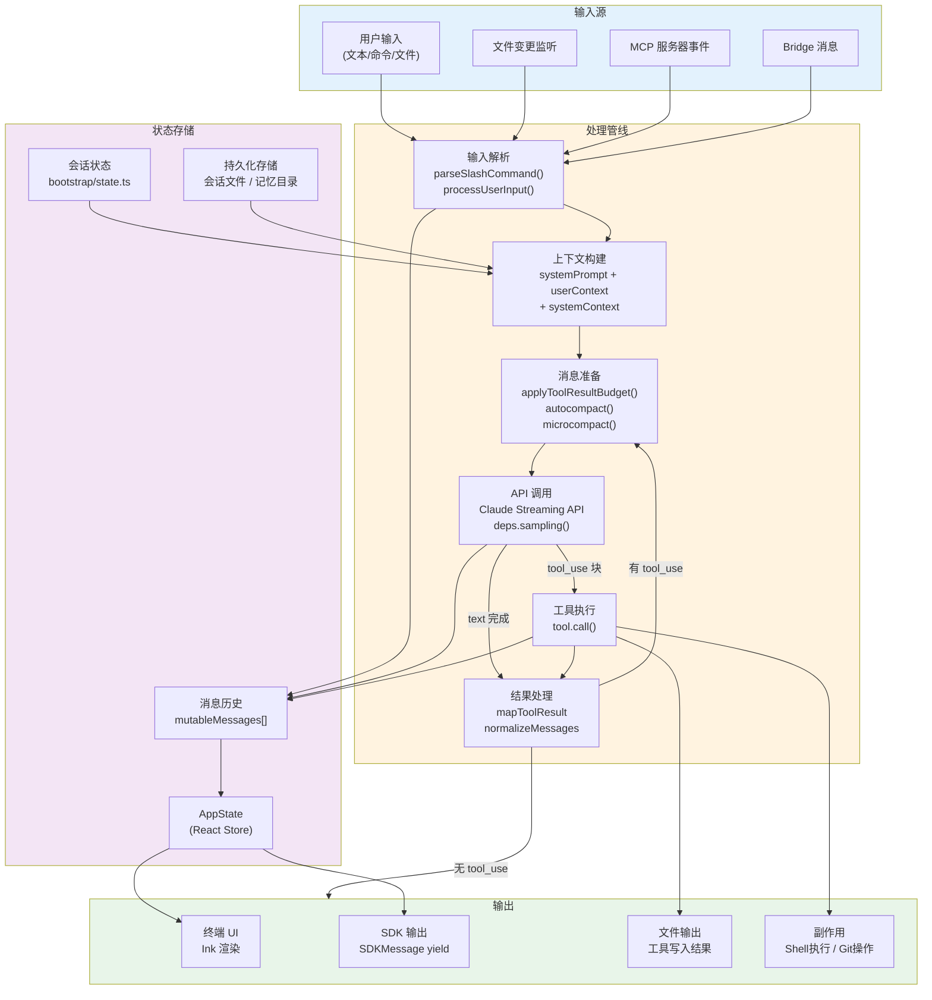
```mermaid
flowchart TB
    subgraph INPUT["输入源"]
        USER_INPUT["用户输入<br/>(文本/命令/文件)"]
        FILE_WATCH["文件变更监听"]
        MCP_EVENT["MCP 服务器事件"]
        BRIDGE_MSG["Bridge 消息"]
    end

    subgraph PROCESSING["处理管线"]
        direction TB
        PARSE["输入解析<br/>parseSlashCommand()<br/>processUserInput()"]
        CTX_BUILD["上下文构建<br/>systemPrompt + userContext<br/>+ systemContext"]
        MSG_PREP["消息准备<br/>applyToolResultBudget()<br/>autocompact()<br/>microcompact()"]
        API_CALL["API 调用<br/>Claude Streaming API<br/>deps.sampling()"]
        TOOL_EXEC["工具执行<br/>tool.call()"]
        RESULT_PROC["结果处理<br/>mapToolResult<br/>normalizeMessages"]
    end

    subgraph STATE["状态存储"]
        MESSAGES["消息历史<br/>mutableMessages[]"]
        APP_STATE["AppState<br/>(React Store)"]
        BOOT_STATE["会话状态<br/>bootstrap/state.ts"]
        PERSIST["持久化存储<br/>会话文件 / 记忆目录"]
    end

    subgraph OUTPUT["输出"]
        TERM_UI["终端 UI<br/>Ink 渲染"]
        SDK_OUT["SDK 输出<br/>SDKMessage yield"]
        FILE_OUT["文件输出<br/>工具写入结果"]
        SIDE_EFFECT["副作用<br/>Shell执行 / Git操作"]
    end

    USER_INPUT --> PARSE
    FILE_WATCH --> PARSE
    MCP_EVENT --> PARSE
    BRIDGE_MSG --> PARSE

    PARSE --> CTX_BUILD
    CTX_BUILD --> MSG_PREP
    MSG_PREP --> API_CALL
    API_CALL -->|"tool_use 块"| TOOL_EXEC
    API_CALL -->|"text 完成"| RESULT_PROC
    TOOL_EXEC --> RESULT_PROC
    RESULT_PROC -->|"有 tool_use"| MSG_PREP
    RESULT_PROC -->|"无 tool_use"| OUTPUT

    PARSE --> MESSAGES
    API_CALL --> MESSAGES
    TOOL_EXEC --> MESSAGES
    MESSAGES --> APP_STATE
    APP_STATE --> TERM_UI
    APP_STATE --> SDK_OUT

    TOOL_EXEC --> FILE_OUT
    TOOL_EXEC --> SIDE_EFFECT

    BOOT_STATE --> CTX_BUILD
    PERSIST --> CTX_BUILD

    style INPUT fill:#E3F2FD
    style PROCESSING fill:#FFF3E0
    style STATE fill:#F3E5F5
    style OUTPUT fill:#E8F5E9
```

### 上下文组装数据流

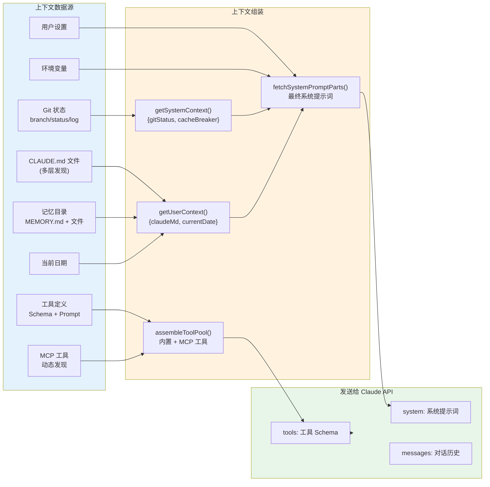
```mermaid
flowchart LR
    subgraph SOURCES["上下文数据源"]
        GIT["Git 状态<br/>branch/status/log"]
        CLAUDE_MD["CLAUDE.md 文件<br/>(多层发现)"]
        MEMORY["记忆目录<br/>MEMORY.md + 文件"]
        DATE["当前日期"]
        TOOLS_DEF["工具定义<br/>Schema + Prompt"]
        MCP_TOOLS["MCP 工具<br/>动态发现"]
        SETTINGS["用户设置"]
        ENV["环境变量"]
    end

    subgraph ASSEMBLY["上下文组装"]
        SYS_CTX["getSystemContext()<br/>{gitStatus, cacheBreaker}"]
        USER_CTX["getUserContext()<br/>{claudeMd, currentDate}"]
        TOOL_POOL["assembleToolPool()<br/>内置 + MCP 工具"]
        SYS_PROMPT["fetchSystemPromptParts()<br/>最终系统提示词"]
    end

    subgraph API_MSG["发送给 Claude API"]
        SYSTEM["system: 系统提示词"]
        TOOLS["tools: 工具 Schema"]
        MESSAGES["messages: 对话历史"]
    end

    GIT --> SYS_CTX
    CLAUDE_MD --> USER_CTX
    MEMORY --> USER_CTX
    DATE --> USER_CTX
    TOOLS_DEF --> TOOL_POOL
    MCP_TOOLS --> TOOL_POOL
    SETTINGS --> SYS_PROMPT
    ENV --> SYS_PROMPT

    SYS_CTX --> SYS_PROMPT
    USER_CTX --> SYS_PROMPT
    SYS_PROMPT --> SYSTEM
    TOOL_POOL --> TOOLS
    TOOLS --> API_MSG

    style SOURCES fill:#E3F2FD
    style ASSEMBLY fill:#FFF3E0
    style API_MSG fill:#E8F5E9
```

### 权限决策数据流

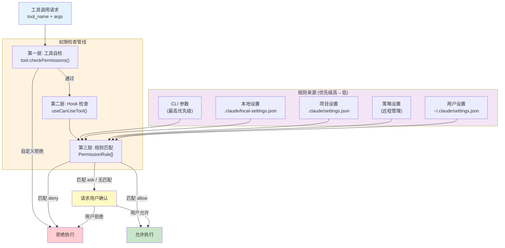
```mermaid
flowchart TB
    TOOL_CALL["工具调用请求<br/>tool_name + args"]

    subgraph CHECK["权限检查管线"]
        direction TB
        TOOL_CHECK["第一层: 工具自检<br/>tool.checkPermissions()"]
        HOOK_CHECK["第二层: Hook 检查<br/>useCanUseTool()"]
        RULE_MATCH["第三层: 规则匹配<br/>PermissionRule[]"]
    end

    subgraph RULES["规则来源 (优先级高→低)"]
        CLI_ARG["CLI 参数<br/>(最高优先级)"]
        LOCAL_SET["本地设置<br/>.claude/local-settings.json"]
        PROJECT_SET["项目设置<br/>.claude/settings.json"]
        POLICY_SET["策略设置<br/>(远程管理)"]
        USER_SET["用户设置<br/>~/.claude/settings.json"]
    end

    ALLOW["允许执行"]
    DENY["拒绝执行"]
    ASK["请求用户确认"]

    TOOL_CALL --> TOOL_CHECK
    TOOL_CHECK -->|"自定义拒绝"| DENY
    TOOL_CHECK -->|"通过"| HOOK_CHECK
    HOOK_CHECK --> RULE_MATCH

    CLI_ARG --> RULE_MATCH
    LOCAL_SET --> RULE_MATCH
    PROJECT_SET --> RULE_MATCH
    POLICY_SET --> RULE_MATCH
    USER_SET --> RULE_MATCH

    RULE_MATCH -->|"匹配 allow"| ALLOW
    RULE_MATCH -->|"匹配 deny"| DENY
    RULE_MATCH -->|"匹配 ask / 无匹配"| ASK
    ASK -->|"用户允许"| ALLOW
    ASK -->|"用户拒绝"| DENY

    style TOOL_CALL fill:#E3F2FD
    style CHECK fill:#FFF3E0
    style RULES fill:#F3E5F5
    style ALLOW fill:#C8E6C9
    style DENY fill:#FFCDD2
    style ASK fill:#FFF9C4
```

---

## 核心模块详解

### 入口与初始化

**启动链路**: `cli.tsx` → `main.tsx:main()` → `init.ts:init()`

```
cli.tsx
├── 快速路径检查 (--version, --daemon-worker)
└── 调用 main()

main.tsx [803KB, 主编排器]
├── 并行预取: startMdmRawRead() + startKeychainPrefetch()
├── 加载配置: loadSettingsFromFlag()
├── 初始化: init() → 网络/代理/TLS/mTLS
├── 注册表: getCommands() + getTools()
├── 上下文: getSystemContext() + getUserContext()
├── 路由:
│   ├── REPL 模式 → renderAndRun() → Ink UI
│   └── Headless 模式 → runHeadless() → QueryEngine
└── 清理: registerCleanup() handlers

init.ts [memoized, 只执行一次]
├── enableConfigs() → 验证并启用配置系统
├── 并行异步: OAuth / 仓库检测 / 事件日志 / IDE 检测
├── 网络配置: mTLS + 全局代理 + API 预连接
├── 数据迁移: v1..v11 顺序执行
└── 清理注册: LSP / 团队会话 / 临时目录
```

**关键设计**:
- `init()` 使用 memoize，保证整个会话只初始化一次
- API 预连接（`preconnectAnthropicApi()`）在初始化阶段就建立 TCP+TLS，减少首次请求延迟
- 异步任务不阻塞启动流程，通过 `Promise.all` 并行

### 查询引擎（QueryEngine）

**核心类**: `QueryEngine` (SDK 接口) + `query()` (内部 AsyncGenerator)

```typescript
// QueryEngine - 面向 SDK 的封装
class QueryEngine {
  constructor(config: QueryEngineConfig)
  submitMessage(prompt, options): AsyncGenerator<SDKMessage>
  getMessages(): Message[]
  getUsage(): Usage
  abort(): void
}

// query() - 内部查询循环
async function* query(params): AsyncGenerator<QueryEvent> {
  while (true) {
    // 1. 上下文准备 (compact/collapse/snip)
    // 2. API 调用 (streaming)
    // 3. 工具执行
    // 4. 决定: 继续 or 终止
  }
}
```

**查询循环状态机**:

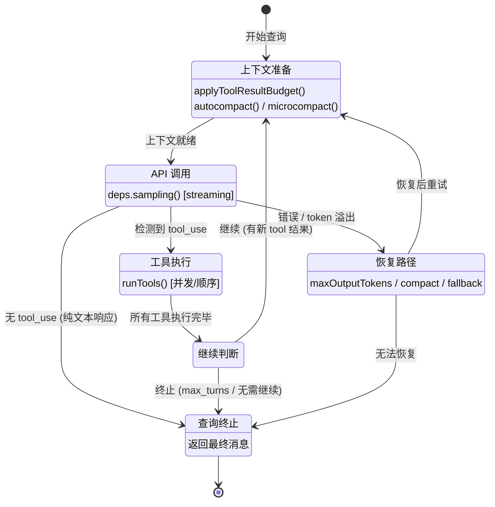
```mermaid
stateDiagram-v2
    [*] --> ContextPrep: 开始查询

    ContextPrep: 上下文准备
    ContextPrep: applyToolResultBudget()
    ContextPrep: autocompact() / microcompact()

    Sampling: API 调用
    Sampling: deps.sampling() [streaming]

    ToolExec: 工具执行
    ToolExec: runTools() [并发/顺序]

    Decision: 继续判断

    Terminal: 查询终止
    Terminal: 返回最终消息

    Recovery: 恢复路径
    Recovery: maxOutputTokens / compact / fallback

    ContextPrep --> Sampling: 上下文就绪
    Sampling --> ToolExec: 检测到 tool_use
    Sampling --> Terminal: 无 tool_use (纯文本响应)
    ToolExec --> Decision: 所有工具执行完毕
    Decision --> ContextPrep: 继续 (有新 tool 结果)
    Decision --> Terminal: 终止 (max_turns / 无需继续)
    Sampling --> Recovery: 错误 / token 溢出
    Recovery --> ContextPrep: 恢复后重试
    Recovery --> Terminal: 无法恢复
    Terminal --> [*]
```

**关键特性**:
- **AsyncGenerator 模式**: 查询循环通过 `yield` 逐步返回事件，支持流式 UI 渲染
- **自动压缩**: 当消息历史超过 token 预算时，自动调用 compact 服务总结旧消息
- **恢复路径**: 输出 token 耗尽时自动增大限制重试；极端情况回退到备用模型

### 工具系统（Tool System）

**架构分层**:


```mermaid
graph TB
    subgraph "工具注册 (Registration)"
        ALL_BASE["getAllBaseTools()<br/>所有基础工具"]
        GET_TOOLS["getTools(permCtx)<br/>过滤后的工具"]
        ASSEMBLE["assembleToolPool(permCtx, mcpTools)<br/>最终工具池"]
    end

    subgraph "工具抽象 (Tool.ts)"
        TOOL_IF["Tool 接口"]
        TOOL_IF --- call["call(args, ctx)"]
        TOOL_IF --- schema["inputSchema (Zod)"]
        TOOL_IF --- perm["checkPermissions()"]
        TOOL_IF --- render["render*() 方法"]
        TOOL_IF --- meta["isReadOnly() / isConcurrencySafe()"]
    end

    subgraph "工具实现 (45+)"
        direction LR
        BASH_T["BashTool<br/>Shell 执行"]
        READ_T["FileReadTool<br/>文件读取"]
        EDIT_T["FileEditTool<br/>字符串替换"]
        WRITE_T["FileWriteTool<br/>文件写入"]
        GREP_T["GrepTool<br/>内容搜索"]
        GLOB_T["GlobTool<br/>文件搜索"]
        AGENT_T["AgentTool<br/>子Agent"]
        TODO_T["TodoWriteTool<br/>任务列表"]
        MCP_T["MCPTool<br/>MCP 动态"]
        SEARCH_T["ToolSearchTool<br/>延迟加载"]
    end

    ALL_BASE --> GET_TOOLS
    GET_TOOLS --> ASSEMBLE
    TOOL_IF --> BASH_T
    TOOL_IF --> READ_T
    TOOL_IF --> EDIT_T
    TOOL_IF --> WRITE_T
    TOOL_IF --> GREP_T
    TOOL_IF --> GLOB_T
    TOOL_IF --> AGENT_T
    TOOL_IF --> TODO_T
    TOOL_IF --> MCP_T
    TOOL_IF --> SEARCH_T
```

**每个工具的目录结构**:
```
tools/BashTool/
├── BashTool.tsx          # 核心实现: call(), inputSchema, outputSchema
├── prompt.ts             # 系统提示词片段 (指导 Claude 如何使用此工具)
├── UI.tsx                # React 组件: 进度展示、结果渲染
├── bashPermissions.ts    # 权限检查: 命令白名单/黑名单
└── utils.ts              # 辅助函数
```

**工具生命周期**:
1. **注册**: `getAllBaseTools()` 创建工具实例数组，feature gate 控制条件注册
2. **过滤**: `getTools()` 根据权限上下文、环境模式过滤可用工具
3. **组装**: `assembleToolPool()` 合并内置工具 + MCP 工具，去重（内置优先）
4. **序列化**: `toolToAPISchema()` 将工具转换为 Claude API 格式
5. **执行**: `tool.call()` 执行后返回 `ToolResult<Output>`
6. **渲染**: `renderToolUseMessage()` / `renderToolResultMessage()` UI 展示

### 命令系统（Command System）

**两级注册**:

```typescript
type Command = {
  name: string
  description: string
  type: 'prompt' | 'local' | 'jsx'  // 三种命令类型
  execute?: (context) => void        // local 类型
  getPrompt?: (args) => string       // prompt 类型
  render?: () => JSX.Element         // jsx 类型
}
```

```
getCommands() [memoized]
├── 内置命令 (154+ 导入)
│   ├── 核心: clear, help, status, init
│   ├── 开发: commit, review, diff, branch
│   ├── 配置: config, keybindings, theme, color
│   ├── 分析: cost, context, memory, effort
│   ├── 集成: mcp, ide, desktop, chrome, bridge
│   └── 高级: compact, fork, proactive, brief
│
├── 动态技能命令
│   ├── getSkillDirCommands()     → ~/.claude/skills/
│   ├── getDynamicSkills()        → 用户创建的命令
│   └── getBundledSkills()        → 内置技能命令
│
└── 插件命令
    ├── getPluginCommands()       → 已安装插件
    └── getBuiltinPluginSkillCommands()
```

### 服务层（Services）

#### API 服务 (`services/api/`)

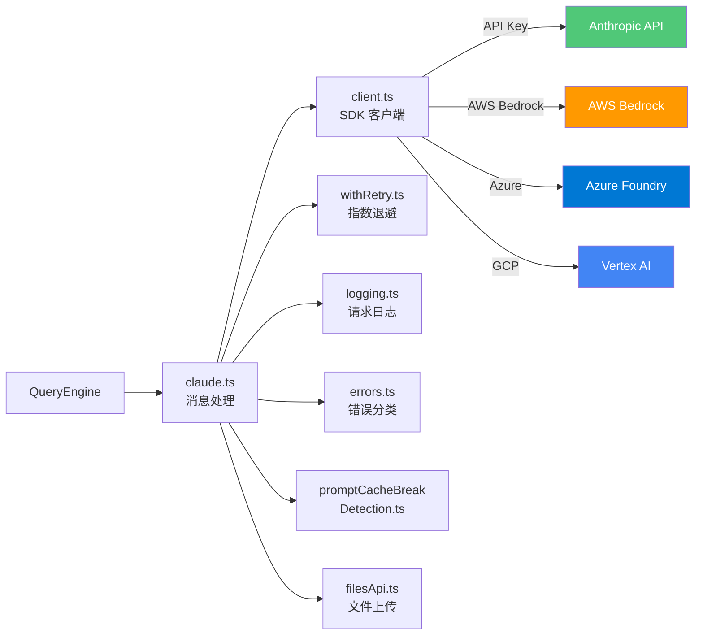
```mermaid
flowchart LR
    QE["QueryEngine"] --> CLAUDE["claude.ts<br/>消息处理"]
    CLAUDE --> CLIENT["client.ts<br/>SDK 客户端"]

    CLIENT -->|"API Key"| ANTHROPIC["Anthropic API"]
    CLIENT -->|"AWS Bedrock"| BEDROCK["AWS Bedrock"]
    CLIENT -->|"Azure"| AZURE["Azure Foundry"]
    CLIENT -->|"GCP"| VERTEX["Vertex AI"]

    CLAUDE --> RETRY["withRetry.ts<br/>指数退避"]
    CLAUDE --> LOG["logging.ts<br/>请求日志"]
    CLAUDE --> ERR["errors.ts<br/>错误分类"]
    CLAUDE --> CACHE["promptCacheBreak<br/>Detection.ts"]
    CLAUDE --> FILES["filesApi.ts<br/>文件上传"]

    style ANTHROPIC fill:#50C878,color:#fff
    style BEDROCK fill:#FF9900,color:#fff
    style AZURE fill:#0078D4,color:#fff
    style VERTEX fill:#4285F4,color:#fff
```

**关键功能**:
- **流式处理**: 支持 Server-Sent Events 流式响应
- **工具序列化**: `toolToAPISchema()` 将 Zod Schema → JSON Schema
- **Prompt Cache**: 缓存系统提示词，减少重复 token 计费
- **多后端支持**: 一套接口支持 4 种 AI 后端

#### MCP 服务 (`services/mcp/`)

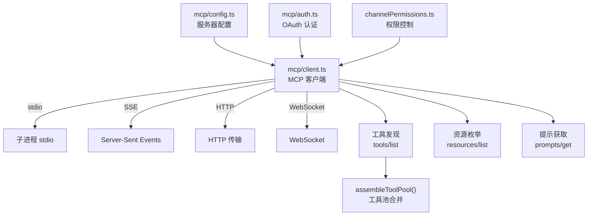
```mermaid
flowchart TB
    CONFIG["mcp/config.ts<br/>服务器配置"] --> CLIENT["mcp/client.ts<br/>MCP 客户端"]

    CLIENT -->|"stdio"| STDIO["子进程 stdio"]
    CLIENT -->|"SSE"| SSE["Server-Sent Events"]
    CLIENT -->|"HTTP"| HTTP["HTTP 传输"]
    CLIENT -->|"WebSocket"| WS["WebSocket"]

    CLIENT --> TOOLS["工具发现<br/>tools/list"]
    CLIENT --> RESOURCES["资源枚举<br/>resources/list"]
    CLIENT --> PROMPTS["提示获取<br/>prompts/get"]

    AUTH["mcp/auth.ts<br/>OAuth 认证"] --> CLIENT
    PERM["channelPermissions.ts<br/>权限控制"] --> CLIENT

    TOOLS --> POOL["assembleToolPool()<br/>工具池合并"]
```

### 状态管理（State）

**三层状态架构**:

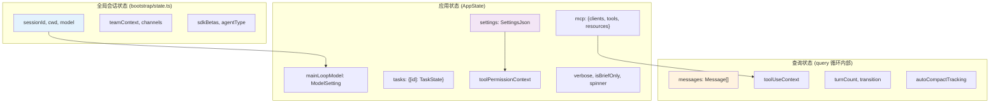
```mermaid
graph TB
    subgraph "全局会话状态 (bootstrap/state.ts)"
        SESSION["sessionId, cwd, model"]
        TEAM["teamContext, channels"]
        SDK["sdkBetas, agentType"]
    end

    subgraph "应用状态 (AppState)"
        SETTINGS_S["settings: SettingsJson"]
        MODEL["mainLoopModel: ModelSetting"]
        TASKS["tasks: {[id]: TaskState}"]
        MCP_S["mcp: {clients, tools, resources}"]
        PERMS["toolPermissionContext"]
        UI_S["verbose, isBriefOnly, spinner"]
    end

    subgraph "查询状态 (query 循环内部)"
        MSGS["messages: Message[]"]
        TOOL_CTX["toolUseContext"]
        TURN["turnCount, transition"]
        COMPACT_S["autoCompactTracking"]
    end

    SESSION --> MODEL
    SETTINGS_S --> PERMS
    MCP_S --> TOOL_CTX

    style SESSION fill:#E3F2FD
    style SETTINGS_S fill:#F3E5F5
    style MSGS fill:#FFF3E0
```

**状态更新模式**:
- `store.ts` 实现最小化发布-订阅模式
- `useAppState(selector)` 精准订阅（Object.is 比较）
- 不可变更新: `setState(prev => ({...prev, ...changes}))`

### UI 渲染层（Ink/React）

**自定义终端渲染引擎**:

```
ink/
├── reconciler.ts          # React reconciler (连接 React 与终端)
├── renderer.ts            # 终端输出生成
├── render-to-screen.ts    # 缓冲区 → 屏幕渲染
├── layout/
│   ├── engine.ts          # Yoga 布局计算
│   ├── geometry.ts        # 几何计算
│   └── node.ts            # 布局树节点
├── events/
│   ├── keyboard.ts        # 键盘事件
│   ├── click.ts           # 点击事件
│   └── focus.ts           # 焦点管理
└── components/
    ├── Box.tsx             # 布局容器
    ├── Text.tsx            # 文本渲染
    ├── Button.tsx          # 交互按钮
    └── ScrollBox.tsx       # 滚动容器
```

**组件层次**:
```
App.tsx
└── FpsMetricsProvider
    └── StatsProvider
        └── AppStateProvider
            └── FullscreenLayout.tsx [85KB]
                ├── 消息列表 (对话历史)
                ├── 工具进度指示器
                ├── REPL 输入框
                ├── 状态栏
                ├── 模态对话框层
                └── 通知层
```

---

## 权限系统架构

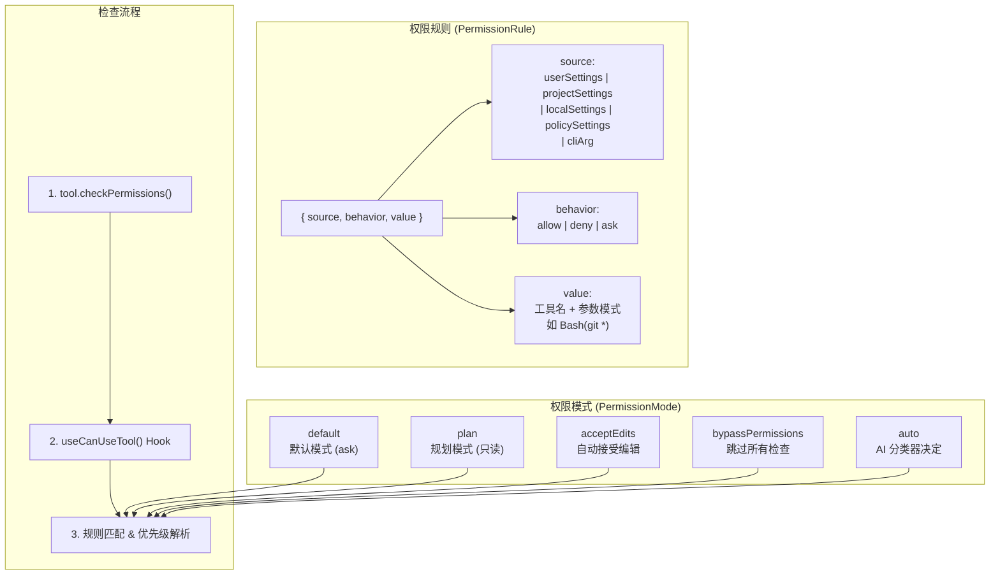
```mermaid
graph TB
    subgraph "权限模式 (PermissionMode)"
        DEFAULT["default<br/>默认模式 (ask)"]
        PLAN["plan<br/>规划模式 (只读)"]
        ACCEPT["acceptEdits<br/>自动接受编辑"]
        BYPASS["bypassPermissions<br/>跳过所有检查"]
        AUTO["auto<br/>AI 分类器决定"]
    end

    subgraph "权限规则 (PermissionRule)"
        RULE["{ source, behavior, value }"]
        RULE --> SRC["source:<br/>userSettings | projectSettings<br/>| localSettings | policySettings<br/>| cliArg"]
        RULE --> BHV["behavior:<br/>allow | deny | ask"]
        RULE --> VAL["value:<br/>工具名 + 参数模式<br/>如 Bash(git *)"]
    end

    subgraph "检查流程"
        C1["1. tool.checkPermissions()"]
        C2["2. useCanUseTool() Hook"]
        C3["3. 规则匹配 & 优先级解析"]
    end

    C1 --> C2 --> C3
    DEFAULT --> C3
    PLAN --> C3
    ACCEPT --> C3
    BYPASS --> C3
    AUTO --> C3
```

**规则匹配示例**:
- `Bash(git *)` → 允许所有 git 命令
- `FileEditTool(src/**)` → 允许编辑 src 目录下的文件
- `WebFetchTool` → 控制所有网络请求

---

## MCP 集成架构

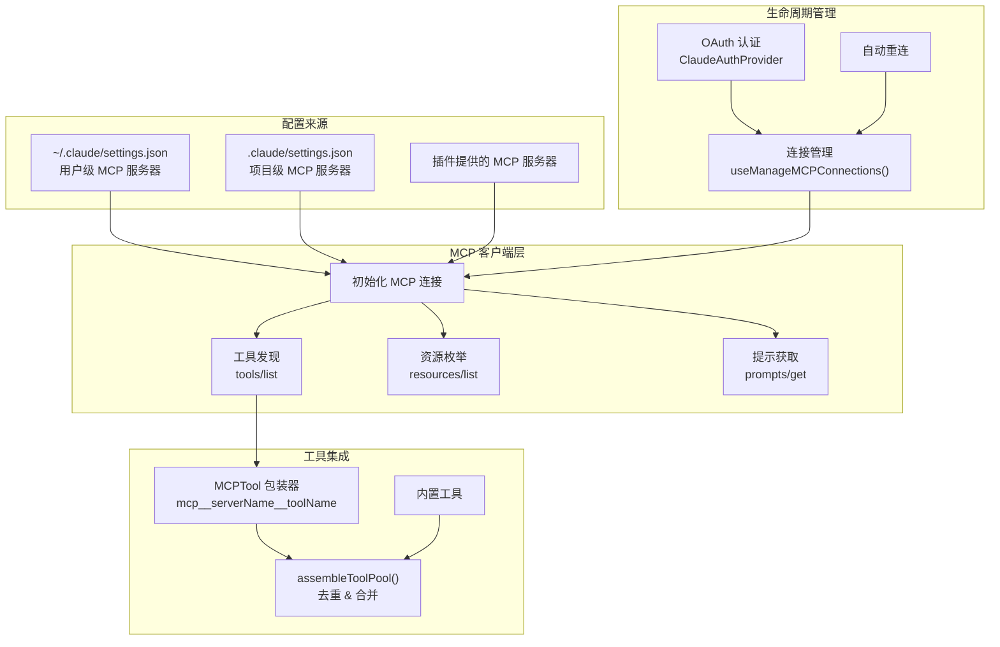
```mermaid
flowchart TB
    subgraph "配置来源"
        USER_CFG["~/.claude/settings.json<br/>用户级 MCP 服务器"]
        PROJ_CFG[".claude/settings.json<br/>项目级 MCP 服务器"]
        PLUGIN_CFG["插件提供的 MCP 服务器"]
    end

    subgraph "MCP 客户端层"
        INIT_MCP["初始化 MCP 连接"]
        DISCOVER["工具发现<br/>tools/list"]
        ENUM_RES["资源枚举<br/>resources/list"]
        FETCH_PROMPT["提示获取<br/>prompts/get"]
    end

    subgraph "工具集成"
        MCP_TOOL["MCPTool 包装器<br/>mcp__serverName__toolName"]
        BUILTIN["内置工具"]
        POOL["assembleToolPool()<br/>去重 & 合并"]
    end

    subgraph "生命周期管理"
        CONNECT["连接管理<br/>useManageMCPConnections()"]
        AUTH_MCP["OAuth 认证<br/>ClaudeAuthProvider"]
        RECONNECT["自动重连"]
    end

    USER_CFG --> INIT_MCP
    PROJ_CFG --> INIT_MCP
    PLUGIN_CFG --> INIT_MCP

    INIT_MCP --> DISCOVER
    INIT_MCP --> ENUM_RES
    INIT_MCP --> FETCH_PROMPT

    DISCOVER --> MCP_TOOL
    MCP_TOOL --> POOL
    BUILTIN --> POOL

    CONNECT --> INIT_MCP
    AUTH_MCP --> CONNECT
    RECONNECT --> CONNECT
```

**MCP 工具命名规则**: `mcp__<服务器名>__<工具名>`，内置工具同名时优先使用内置版本。

---

## 多 Agent 协调架构

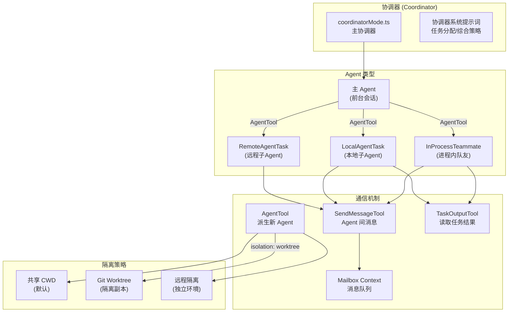
```mermaid
flowchart TB
    subgraph "协调器 (Coordinator)"
        COORD["coordinatorMode.ts<br/>主协调器"]
        PROMPT_C["协调器系统提示词<br/>任务分配/综合策略"]
    end

    subgraph "Agent 类型"
        MAIN_AGENT["主 Agent<br/>(前台会话)"]
        TEAMMATE["InProcessTeammate<br/>(进程内队友)"]
        LOCAL_AGENT["LocalAgentTask<br/>(本地子Agent)"]
        REMOTE_AGENT["RemoteAgentTask<br/>(远程子Agent)"]
    end

    subgraph "通信机制"
        AGENT_TOOL["AgentTool<br/>派生新 Agent"]
        SEND_MSG["SendMessageTool<br/>Agent 间消息"]
        MAILBOX["Mailbox Context<br/>消息队列"]
        TASK_OUTPUT["TaskOutputTool<br/>读取任务结果"]
    end

    subgraph "隔离策略"
        SHARED["共享 CWD<br/>(默认)"]
        WORKTREE["Git Worktree<br/>(隔离副本)"]
        REMOTE_ISO["远程隔离<br/>(独立环境)"]
    end

    COORD --> MAIN_AGENT
    MAIN_AGENT -->|"AgentTool"| TEAMMATE
    MAIN_AGENT -->|"AgentTool"| LOCAL_AGENT
    MAIN_AGENT -->|"AgentTool"| REMOTE_AGENT

    TEAMMATE --> SEND_MSG
    LOCAL_AGENT --> SEND_MSG
    REMOTE_AGENT --> SEND_MSG
    SEND_MSG --> MAILBOX

    AGENT_TOOL --> SHARED
    AGENT_TOOL -->|"isolation: worktree"| WORKTREE
    AGENT_TOOL --> REMOTE_ISO

    TEAMMATE --> TASK_OUTPUT
    LOCAL_AGENT --> TASK_OUTPUT
```

**任务类型**:

| 类型 | ID 前缀 | 说明 |
|------|---------|------|
| `local_bash` | `b` | 本地 Shell 任务 |
| `local_agent` | `a` | 本地子 Agent |
| `remote_agent` | `r` | 远程子 Agent |
| `in_process_teammate` | `t` | 进程内队友 |
| `local_workflow` | `w` | 本地工作流 |
| `monitor_mcp` | `m` | MCP 监控 |
| `dream` | `d` | Dream 任务 |

---

## 会话管理架构

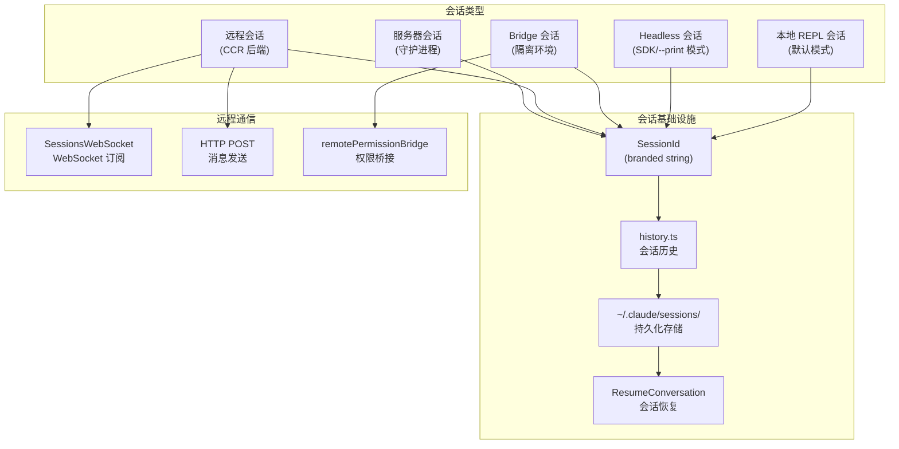
```mermaid
flowchart TB
    subgraph "会话类型"
        LOCAL["本地 REPL 会话<br/>(默认模式)"]
        HEADLESS["Headless 会话<br/>(SDK/--print 模式)"]
        BRIDGE_S["Bridge 会话<br/>(隔离环境)"]
        REMOTE_S["远程会话<br/>(CCR 后端)"]
        SERVER_S["服务器会话<br/>(守护进程)"]
    end

    subgraph "会话基础设施"
        SESSION_ID["SessionId<br/>(branded string)"]
        HISTORY["history.ts<br/>会话历史"]
        PERSIST_S["~/.claude/sessions/<br/>持久化存储"]
        RESUME["ResumeConversation<br/>会话恢复"]
    end

    subgraph "远程通信"
        WS["SessionsWebSocket<br/>WebSocket 订阅"]
        HTTP_POST["HTTP POST<br/>消息发送"]
        PERM_BRIDGE["remotePermissionBridge<br/>权限桥接"]
    end

    LOCAL --> SESSION_ID
    HEADLESS --> SESSION_ID
    BRIDGE_S --> SESSION_ID
    REMOTE_S --> SESSION_ID
    SERVER_S --> SESSION_ID

    SESSION_ID --> HISTORY
    HISTORY --> PERSIST_S
    PERSIST_S --> RESUME

    REMOTE_S --> WS
    REMOTE_S --> HTTP_POST
    BRIDGE_S --> PERM_BRIDGE
```

---

## 配置与设置层级

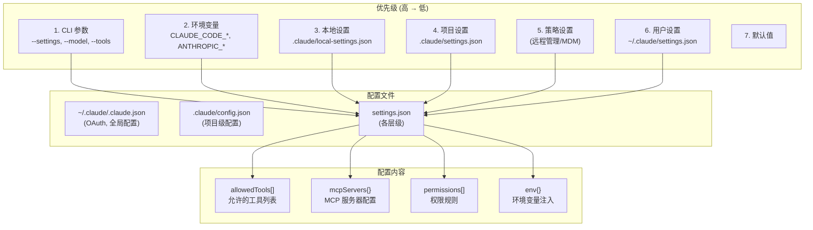
```mermaid
flowchart TB
    subgraph "优先级 (高 → 低)"
        direction TB
        P1["1. CLI 参数<br/>--settings, --model, --tools"]
        P2["2. 环境变量<br/>CLAUDE_CODE_*, ANTHROPIC_*"]
        P3["3. 本地设置<br/>.claude/local-settings.json"]
        P4["4. 项目设置<br/>.claude/settings.json"]
        P5["5. 策略设置<br/>(远程管理/MDM)"]
        P6["6. 用户设置<br/>~/.claude/settings.json"]
        P7["7. 默认值"]
    end

    subgraph "配置文件"
        GLOBAL_CFG["~/.claude/.claude.json<br/>(OAuth, 全局配置)"]
        PROJECT_CFG[".claude/config.json<br/>(项目级配置)"]
        SETTINGS_JSON["settings.json<br/>(各层级)"]
    end

    subgraph "配置内容"
        ALLOWED_TOOLS["allowedTools[]<br/>允许的工具列表"]
        MCP_SERVERS["mcpServers{}<br/>MCP 服务器配置"]
        PERM_RULES["permissions[]<br/>权限规则"]
        ENV_VARS["env{}<br/>环境变量注入"]
    end

    P1 --> SETTINGS_JSON
    P2 --> SETTINGS_JSON
    P3 --> SETTINGS_JSON
    P4 --> SETTINGS_JSON
    P5 --> SETTINGS_JSON
    P6 --> SETTINGS_JSON

    SETTINGS_JSON --> ALLOWED_TOOLS
    SETTINGS_JSON --> MCP_SERVERS
    SETTINGS_JSON --> PERM_RULES
    SETTINGS_JSON --> ENV_VARS
```

---

## Feature Gate 机制

Claude Code 使用三层 Feature Gate 控制功能可用性：

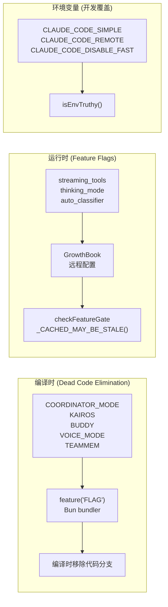
```mermaid
flowchart LR
    subgraph "编译时 (Dead Code Elimination)"
        FEATURE["feature('FLAG')<br/>Bun bundler"]
        FEATURE --> DCE["编译时移除代码分支"]
        FLAGS_B["COORDINATOR_MODE<br/>KAIROS<br/>BUDDY<br/>VOICE_MODE<br/>TEAMMEM"]
        FLAGS_B --> FEATURE
    end

    subgraph "运行时 (Feature Flags)"
        GROWTHBOOK["GrowthBook<br/>远程配置"]
        GROWTHBOOK --> CACHED["checkFeatureGate<br/>_CACHED_MAY_BE_STALE()"]
        FLAGS_R["streaming_tools<br/>thinking_mode<br/>auto_classifier"]
        FLAGS_R --> GROWTHBOOK
    end

    subgraph "环境变量 (开发覆盖)"
        ENV_V["isEnvTruthy()"]
        FLAGS_E["CLAUDE_CODE_SIMPLE<br/>CLAUDE_CODE_REMOTE<br/>CLAUDE_CODE_DISABLE_FAST"]
        FLAGS_E --> ENV_V
    end
```

**条件导入模式**:
```typescript
// 编译时: 如果 KAIROS 未启用，整个分支被消除
if (feature('KAIROS')) {
  const { setupKairos } = require('./assistant/kairos')
  setupKairos()
}
```

---

## 关键设计模式总结

### 架构模式

| 模式 | 应用场景 | 说明 |
|------|---------|------|
| **AsyncGenerator** | query() 查询循环 | 逐步 yield 事件，支持流式渲染 |
| **Memoization** | context, commands, tools, init | 避免重复计算/初始化 |
| **Feature Gate** | 条件编译 + 运行时开关 | 三层控制功能可用性 |
| **Plugin Architecture** | MCP + Skills + Plugins | 运行时动态扩展工具能力 |
| **Observer Pattern** | AppState store | subscribe + selector 精准更新 |
| **React Reconciler** | Ink 终端 UI | 自定义 React 渲染器用于终端 |

### 性能优化

| 策略 | 位置 | 效果 |
|------|------|------|
| **API 预连接** | init.ts | 首次请求延迟降低 |
| **Prompt Cache** | claude.ts | 减少重复 token 计费 |
| **自动压缩** | query.ts → compact/ | 控制上下文窗口大小 |
| **懒加载工具** | ToolSearchTool | 减少初始 token 开销 |
| **并行预取** | main.tsx | MDM + Keychain 并行读取 |
| **LRU Cache** | git.ts | findGitRoot 缓存 (50 条目) |

### 安全设计

| 机制 | 实现 |
|------|------|
| **三层权限检查** | Tool 自检 → Hook 审查 → 规则匹配 |
| **规则级联** | deny 优先，任一层拒绝即最终拒绝 |
| **模式隔离** | plan 模式仅允许只读操作 |
| **路径约束** | glob 模式匹配限制工具操作范围 |
| **mTLS** | 全局 mTLS 配置用于企业环境 |
| **MDM 支持** | macOS MDM 策略管理 |

### 可扩展性设计

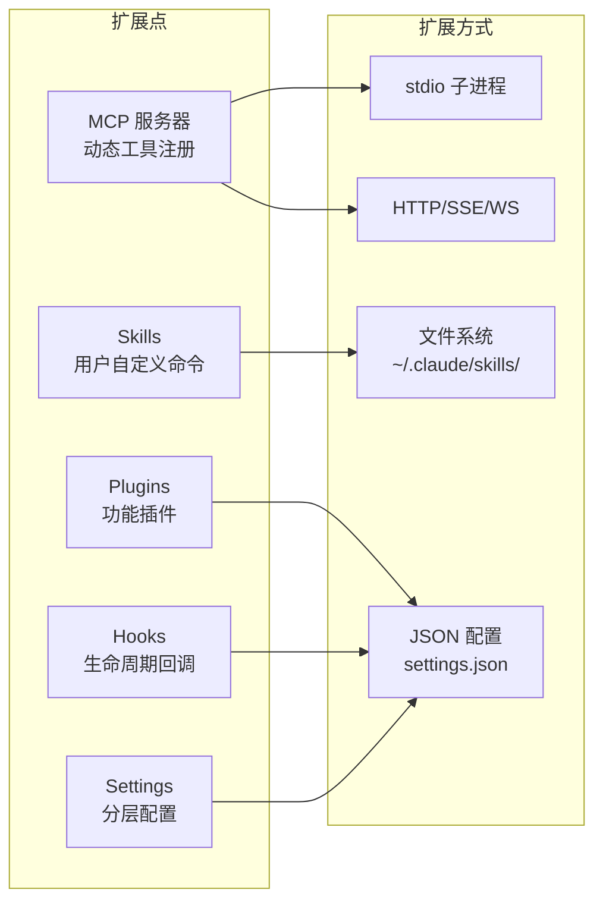
```mermaid
graph LR
    subgraph "扩展点"
        MCP_EXT["MCP 服务器<br/>动态工具注册"]
        SKILL_EXT["Skills<br/>用户自定义命令"]
        PLUGIN_EXT["Plugins<br/>功能插件"]
        HOOK_EXT["Hooks<br/>生命周期回调"]
        SETTING_EXT["Settings<br/>分层配置"]
    end

    subgraph "扩展方式"
        STDIO_T["stdio 子进程"]
        HTTP_T["HTTP/SSE/WS"]
        FILE_T["文件系统<br/>~/.claude/skills/"]
        JSON_T["JSON 配置<br/>settings.json"]
    end

    MCP_EXT --> STDIO_T
    MCP_EXT --> HTTP_T
    SKILL_EXT --> FILE_T
    PLUGIN_EXT --> JSON_T
    HOOK_EXT --> JSON_T
    SETTING_EXT --> JSON_T
```

---

## 附录 A: 关键文件索引

| 文件 | 大小 | 职责 |
|------|------|------|
| `main.tsx` | 803KB | CLI 主入口 & 编排器 |
| `services/api/claude.ts` | 125KB | Claude API 消息流处理 |
| `services/mcp/client.ts` | 120KB | MCP 客户端 |
| `services/mcp/auth.ts` | 90KB | MCP OAuth 认证 |
| `components/FullscreenLayout.tsx` | 85KB | 主终端 UI 布局 |
| `query.ts` | 68KB | 核心查询循环 |
| `utils/auth.ts` | 65KB | 认证工具 |
| `utils/config.ts` | 63KB | 配置管理 |
| `interactiveHelpers.tsx` | 57KB | 交互辅助组件 |
| `bootstrap/state.ts` | 56KB | 全局会话状态 |
| `QueryEngine.ts` | 46KB | SDK 查询引擎 |
| `hooks/useCanUseTool.tsx` | 40KB | 权限检查 Hook |
| `utils/git.ts` | 30KB | Git 操作 |
| `Tool.ts` | 29KB | 工具抽象基类 |
| `commands.ts` | 25KB | 命令注册表 |

## 附录 B: 核心类型定义速查

```typescript
// 权限模式
type PermissionMode = 'acceptEdits' | 'bypassPermissions' | 'default' | 'dontAsk' | 'plan' | 'auto'

// 权限规则
type PermissionRule = {
  source: 'userSettings' | 'projectSettings' | 'localSettings' | 'policySettings' | 'cliArg'
  behavior: 'allow' | 'deny' | 'ask'
  value: string  // 如 "Bash(git *)", "FileEditTool(src/**)"
}

// 工具结果
type ToolResult<Output> = {
  output: Output
  outputForProgressDisplay?: string
}

// 任务类型
type TaskType = 'local_bash' | 'local_agent' | 'remote_agent'
              | 'in_process_teammate' | 'local_workflow' | 'monitor_mcp' | 'dream'

// 任务状态
type TaskStatus = 'pending' | 'running' | 'completed' | 'failed' | 'killed'

// 命令类型
type Command = {
  name: string
  description: string
  type: 'prompt' | 'local' | 'jsx'
}

// 会话/Agent ID (branded string)
type SessionId = string & { __brand: 'SessionId' }
type AgentId = string & { __brand: 'AgentId' }
```
