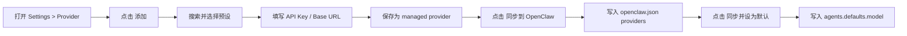
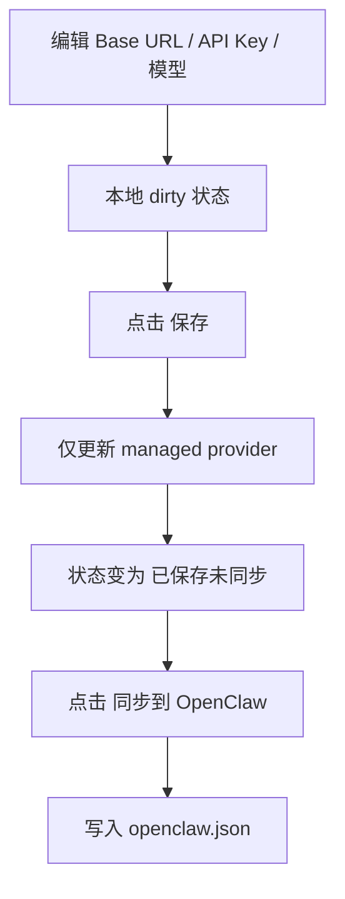
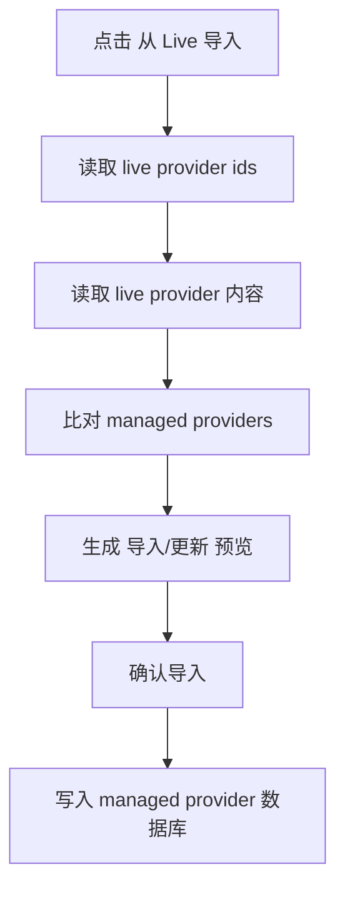

# Warwolf 模型服务设置线框与实施拆解

## 1. 目的

本文件是 [warwolf-provider-settings-design-review.md](/Users/champion/Documents/develop/Warwolf/open-claude-code/docs/warwolf-provider-settings-design-review.md#L1) 的续篇，用于支持团队进入评审和排期阶段。

内容包含两部分：

- 低保真页面线框
- 前后端实施任务拆解

## 2. 页面线框

## 2.1 设置页总体结构

Warwolf 保持现有设置壳，不改一级导航心智。

```text
+----------------------------------------------------------------------------------+
| Settings                                                                         |
+----------------------+-----------------------------------------------------------+
| General              |                                                           |
| Provider             |  当前设置内容区                                           |
| MCP Servers          |                                                           |
| Permissions          |                                                           |
| Keyboard             |                                                           |
| Data                 |                                                           |
| About                |                                                           |
+----------------------+-----------------------------------------------------------+
```

`Provider` 进入后，右侧内容区改造成三栏工作台。

## 2.2 Provider 工作台主视图

```text
+-------------------------------------------------------------------------------------------------------------------+
| Provider                                                                                                          |
+----------------------+--------------------------------------+----------------------------------------------------+
| Settings Nav         | Provider Library                     | Provider Detail                                    |
|                      |                                      |                                                    |
| General              | [ 搜索模型平台...         ][筛选]   |  DeepSeek                              [ON]       |
| Provider             |                                      |  官网  检测连接  保存  同步到 OpenClaw  设为默认   |
| MCP Servers          |  已配置                              |----------------------------------------------------|
| Permissions          |  [DeepSeek]               [LIVE]     |  基础信息                                          |
| Keyboard             |  [OpenRouter]             [DEFAULT]  |  - 名称                                            |
| Data                 |                                      |  - Provider 类型                                   |
| About                |  官方 / 国内官方 / 聚合 / 自定义     |  - 分类                                            |
|                      |  [Zhipu GLM]                         |                                                    |
|                      |  [Kimi]                              |  认证与连接                                        |
|                      |  [Bailian]                           |  - 协议选择                                        |
|                      |  [自定义 OpenAI 兼容]                |  - Base URL                                        |
|                      |                                      |  - API Key                                         |
|                      |  [从 Live 导入]  [添加]              |  - Header/Auth 绑定                                |
|                      |                                      |                                                    |
|                      |                                      |  模型配置                                          |
|                      |                                      |  - 模型列表                                        |
|                      |                                      |  - 主模型 / 回退模型                               |
|                      |                                      |  - context/max tokens                              |
|                      |                                      |                                                    |
|                      |                                      |  OpenClaw 运行时                                   |
|                      |                                      |  - 默认模型                                        |
|                      |                                      |  - 模型目录                                        |
|                      |                                      |  - env / tools                                     |
|                      |                                      |  - health warnings                                 |
+----------------------+--------------------------------------+----------------------------------------------------+
```

## 2.3 Provider 列表空状态

首次进入时，如果还没有 managed provider：

```text
+------------------------------------------------------+
| Provider Library                                     |
|------------------------------------------------------|
| [ 搜索模型平台... ]                                  |
|                                                      |
|  还没有已配置的模型服务                              |
|  从预设添加，或从 OpenClaw live config 导入          |
|                                                      |
|  [添加 Provider]  [从 Live 导入]                     |
+------------------------------------------------------+
```

空状态目标：

- 不让用户误以为系统不可用
- 把“从预设添加”和“导入现有配置”同时暴露出来

## 2.4 添加 Provider 对话框

建议不沿用 Cherry 的简表单弹窗，而是使用“预设选择器”。

```text
+--------------------------------------------------------------------------------+
| 添加模型服务                                                                   |
|--------------------------------------------------------------------------------|
| [ 搜索 provider / model / 渠道 ]                                               |
|                                                                                |
| 官方 / 国内官方 / 聚合 / 自定义                                                |
|                                                                                |
| [DeepSeek]         OpenAI Completions     2 models      官方站点               |
| [Zhipu GLM]        OpenAI Completions     1 model       获取 API Key           |
| [Kimi]             OpenAI Completions     1 model       官方站点               |
| [OpenRouter]       OpenAI Completions     1 model       官方站点               |
| [自定义兼容 API]    Custom                 手动填写      -                      |
|                                                                                |
| 选中后预览                                                                      |
| - 默认 Base URL                                                                |
| - 默认协议                                                                     |
| - 默认模型                                                                     |
| - 是否支持同步到 OpenClaw                                                      |
|                                                                                |
|                                                   [取消] [下一步]              |
+--------------------------------------------------------------------------------+
```

第二步进入精简编辑态：

```text
+--------------------------------------------------------------------------------+
| 添加模型服务 / DeepSeek                                                        |
|--------------------------------------------------------------------------------|
| 名称                                                                           |
| Base URL                                                                       |
| API Key                                                                        |
| 协议                                                                           |
| 预置模型列表                                                                   |
| [ ] 保存后自动同步到 OpenClaw                                                  |
| [ ] 保存后设为默认                                                             |
|                                                   [返回] [创建]                |
+--------------------------------------------------------------------------------+
```

## 2.5 右侧详情区结构

建议用 section，不建议再套一层复杂 tabs。

```text
+---------------------------------------------------------------------------------+
| DeepSeek                                                [ON]                    |
| 官网  检测连接  保存  同步到 OpenClaw  同步并设为默认  删除                     |
|---------------------------------------------------------------------------------|
| 基础信息                                                                        |
| 名称：DeepSeek                                                                  |
| 分类：国内官方                                                                  |
| 预设来源：deepseek                                                              |
| 描述：xxx                                                                       |
|                                                                                 |
| 认证与连接                                                                      |
| 协议：[OpenAI Completions v]                                                    |
| Base URL: https://api.deepseek.com/v1                                           |
| API Key: sk-**************                                                      |
| [获取 API Key]                                                                  |
| 请求预览：https://api.deepseek.com/v1/chat/completions                          |
|                                                                                 |
| 模型配置                                                                        |
| [获取模型列表] [添加模型]                                                       |
| - deepseek-chat        主模型     64k     8k out                                |
| - deepseek-reasoner    回退模型   64k     8k out                                |
|                                                                                 |
| OpenClaw 运行时                                                                 |
| Live 状态：[已同步]                                                             |
| 默认模型：deepseek/deepseek-chat                                                |
| 模型目录：2 entries                                                             |
| env：已配置                                                                     |
| tools：默认                                                                     |
|                                                                                 |
| 诊断                                                                            |
| [健康扫描通过]                                                                  |
+---------------------------------------------------------------------------------+
```

## 2.6 从 Live 导入流程

```text
+------------------------------------------------------------------------------+
| 从 OpenClaw live config 导入                                                 |
|------------------------------------------------------------------------------|
| 发现以下 live providers：                                                    |
|                                                                              |
| [x] deepseek                                                                 |
| [ ] kimi                                                                     |
| [x] zhipu                                                                    |
|                                                                              |
| 冲突提示：                                                                   |
| - deepseek 已存在，将更新现有 managed provider                               |
| - zhipu 不存在，将新建 managed provider                                      |
|                                                                              |
|                                             [取消] [导入所选 2 项]           |
+------------------------------------------------------------------------------+
```

## 2.7 诊断与风险提示区

在详情区底部常驻一个诊断区，比 Cherry 的“检测”更完整：

```text
+--------------------------------------------------------------+
| 诊断                                                         |
|--------------------------------------------------------------|
| [通过] API 连接正常                                          |
| [警告] 该 provider 尚未同步到 OpenClaw                       |
| [警告] 当前默认模型未指向该 provider                         |
| [通过] openclaw.json 结构健康                                |
+--------------------------------------------------------------+
```

## 3. 关键交互流

## 3.1 从预设创建到设为默认



## 3.2 编辑 provider 与运行时分离



这个流程需要在评审中明确，因为它会直接影响用户对“配置是否已生效”的理解。

## 3.3 从 live config 导入



## 4. 前端实施拆解

## 4.1 页面与组件建议

建议新增或调整如下组件：

- `apps/desktop-shell/src/features/settings/sections/ProviderWorkbench.tsx`
- `apps/desktop-shell/src/features/settings/provider/ProviderLibraryPanel.tsx`
- `apps/desktop-shell/src/features/settings/provider/ProviderLibraryItem.tsx`
- `apps/desktop-shell/src/features/settings/provider/ProviderDetailPane.tsx`
- `apps/desktop-shell/src/features/settings/provider/ProviderHeaderActions.tsx`
- `apps/desktop-shell/src/features/settings/provider/ProviderConnectionSection.tsx`
- `apps/desktop-shell/src/features/settings/provider/ProviderModelsSection.tsx`
- `apps/desktop-shell/src/features/settings/provider/OpenClawRuntimeSection.tsx`
- `apps/desktop-shell/src/features/settings/provider/ProviderDiagnosticsSection.tsx`
- `apps/desktop-shell/src/features/settings/provider/AddProviderDialog.tsx`
- `apps/desktop-shell/src/features/settings/provider/ImportLiveProvidersDialog.tsx`

现有文件建议演进为：

- `ProviderSettings.tsx` 从摘要卡片升级为 workbench 入口
- `SettingsPage.tsx` 保持一级导航不变，只替换 `provider` 内容区域

## 4.2 前端状态层建议

建议在 `apps/desktop-shell/src/lib/tauri` 或独立 `features/settings/provider/api` 下拆出：

- `providerHub.ts`
- `openclawRuntime.ts`
- `providerPresets.ts`

建议的 React Query hooks：

- `useProviderPresets()`
- `useManagedProviders()`
- `useUpsertManagedProvider()`
- `useDeleteManagedProvider()`
- `useImportOpenClawProvidersFromLive()`
- `useOpenClawLiveProviderIds()`
- `useSyncProviderToOpenClaw()`
- `useOpenClawDefaultModel()`
- `useSetOpenClawDefaultModel()`
- `useOpenClawModelCatalog()`
- `useOpenClawEnv()`
- `useOpenClawTools()`
- `useOpenClawHealthWarnings()`

## 4.3 前端任务清单

### Phase 1 UI 骨架

- 把 `Provider` 内容区改为三栏布局
- 新建 provider library 列表面板
- 接入 preset 列表与 managed provider 列表只读展示
- 完成右侧详情页只读展示
- 增加空状态、加载态、错误态

### Phase 2 基础编辑

- 新增 preset 选择器对话框
- 接入 managed provider 创建与编辑
- 接入启用/禁用开关
- 接入删除确认流程
- 支持 dirty state 与离开提醒

### Phase 3 OpenClaw 运行时

- 接入 live provider 标识
- 接入同步到 OpenClaw 按钮
- 接入默认模型展示与设置
- 接入健康扫描结果
- 接入导入 live provider 流程

### Phase 4 模型与高级配置

- 模型列表编辑
- 手动添加/删除模型
- 模型 catalog 管理
- env/tools 编辑器
- 更完整的诊断和测试动作

## 4.4 前端验收标准

以下标准适合作为评审后的开发验收项：

- 用户可在一个页面内完成 provider 查找、创建、编辑、同步
- 用户可以区分“已保存”和“已同步到 OpenClaw”
- 用户能明确看到默认模型与 live 状态
- 空状态、错误态、未配置态都不让人迷路
- 新增 provider 流程在 3 步内完成

## 5. 后端实施拆解

## 5.1 Tauri Command 建议

建议为 Warwolf 增加与 `clawhub123` 对齐的 command 集：

- `provider_hub_presets`
- `provider_hub_list`
- `provider_hub_upsert`
- `provider_hub_delete`
- `provider_hub_sync_openclaw`
- `import_openclaw_providers_from_live`
- `get_openclaw_live_provider_ids`
- `get_openclaw_live_provider`
- `scan_openclaw_config_health`
- `get_openclaw_default_model`
- `set_openclaw_default_model`
- `get_openclaw_model_catalog`
- `set_openclaw_model_catalog`
- `get_openclaw_agents_defaults`
- `set_openclaw_agents_defaults`
- `get_openclaw_env`
- `set_openclaw_env`
- `get_openclaw_tools`
- `set_openclaw_tools`

## 5.2 Rust 能力迁移建议

建议迁移或抽共用的能力模块：

- provider hub 数据结构
- managed provider 持久化
- provider models 持久化
- preset 注册表
- provider 同步 openclaw.json
- openclaw config 读写器
- health scan

如果短期不抽共享 crate，建议先完整对齐 API 语义，避免两边越走越分叉。

## 5.3 后端任务清单

### Phase 1 数据读取

- 暴露 provider preset 列表
- 暴露 managed provider 列表
- 暴露 openclaw live provider ids
- 暴露 default model / env / tools / health 只读接口

### Phase 2 数据写入

- 支持 upsert managed provider
- 支持 delete managed provider
- 支持 import from live
- 支持 sync provider to OpenClaw
- 支持设置默认模型

### Phase 3 高级写入

- 支持 model catalog 写入
- 支持 env/tools 写入
- 支持更细粒度校验与错误分类

## 5.4 后端验收标准

- provider CRUD 可独立于 UI 验证
- sync provider 到 OpenClaw 有确定性的写入结果
- default model 与 model catalog 写入后可再次读回验证
- live import 对“新增/更新”有明确区分
- 错误文案能映射到 UI 的 toast 或 section warning

## 6. 评审时建议确认的实施边界

## 6.1 首版是否支持所有 preset 的可编辑模型

建议：

- 首版支持预置模型展示
- 高级模型编辑可以放到后一阶段

## 6.2 首版是否做连接测试

建议：

- 首版可以先做 OpenClaw health scan
- provider 真实网络测试可放到第二阶段末或第三阶段

## 6.3 是否先做共享 crate

建议：

- 如果近期只服务 Warwolf 落地，可先语义对齐
- 如果 clawhub123 和 Warwolf 会长期双向演进，尽快抽共享 crate

## 7. 里程碑建议

## Milestone A: 可评审原型

目标：

- 三栏布局
- 假数据/只读数据接入
- 页面节奏确认

预计产出：

- 产品、设计、研发共同确认 IA

## Milestone B: 可演示闭环

目标：

- 从 preset 创建 provider
- 保存 managed provider
- 同步到 OpenClaw
- 设为默认

预计产出：

- 一个可完整演示的主流程

## Milestone C: 可上线基础版

目标：

- live import
- health warnings
- 模型管理基础能力
- 错误态与边界态补全

预计产出：

- 用户可真正用于日常配置

## 8. 推荐开发顺序

推荐开发顺序如下：

1. 搭三栏外壳
2. 接 list/preset/runtime 的只读 query
3. 接新增/编辑 provider
4. 接 sync OpenClaw 与默认模型
5. 接导入 live 与健康扫描
6. 最后补模型高级编辑和 env/tools

这样可以让 UI 和数据面同步成熟，不会出现先做一堆表单、最后发现 IA 不成立的返工。
